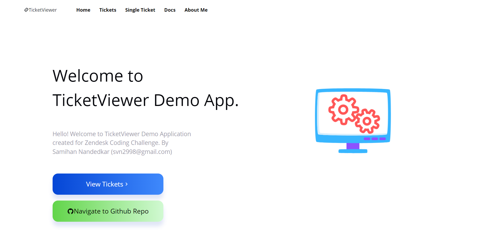

<div id="top"></div>

<!-- PROJECT LOGO -->
<br />
<div align="center">
  <a>
    
  </a>

  <h3 align="center">TicketViewer</h3>

  <p align="center">
    2022 Internship Zendesk Coding Challenge
    <br />
    <br />
    ·
    <a href="https://zcc-app-samihann.herokuapp.com/"><strong>View Demo</strong></a>
    ·
  </p>
</div>

<br/>

| Name        | Samihan Nandedkar|
| ------------- |:-------------:| 
| Email     | svn2998@gmail.com |

<br/>

<!-- TABLE OF CONTENTS -->
<details>
  <summary>Table of Contents</summary>
  <ol>
    <li>
      <a href="#about-the-project">About The Project</a>
      <ul>
        <li><a href="#built-with">Built With</a></li>
      </ul>
    </li>
    <li>
      <a href="#getting-started">Getting Started</a>
      <ul>
        <li><a href="#prerequisites">Prerequisites</a></li>
        <li><a href="#installation">Installation</a></li>
      </ul>
    </li>
    <li><a href="#deployment">Deployment</a></li>
    <li><a href="#testing">Testing</a></li>
    <li><a href="#contact">Contact</a></li>
    <li><a href="#acknowledgments">Acknowledgments</a></li>
  </ol>
</details>

<br/>

<!-- ABOUT THE PROJECT -->
## About The Project



This project is created as a submission for 2022 Internship Zendesk Coding Challenge. The project is a full stack application with React frontend and Express backend. 

The application is able to perform following tasks:
* It is able to connect to Zendesk API using OAuth Token / Basic Authentication . (Token just has Read access)
* Fetch all the tickets for a particular account.
* Display the tickets in systematic format with pagination options.
* Display information about a individual ticket by POST request to Zendesk API with ticket id.

Please refer below to view the project structure. 


<p align="right">(<a href="#top">back to top</a>)</p>


### Built With

Major frameworks/libraries used to create the project. 

* [React.js](https://reactjs.org/)
* [Express.js](https://expressjs.com/)
* [Node.js](https://nodejs.org/en/)
* [Axios](https://axios-http.com/docs/intro)
* [React Bootstrap](https://react-bootstrap.github.io/)
* [MUI Datatables](https://github.com/gregnb/mui-datatables)
* [Styled Components](https://styled-components.com/)
* [Zendesk API](https://developer.zendesk.com/api-reference/)

<p align="right">(<a href="#top">back to top</a>)</p>


<!-- GETTING STARTED -->
## Getting Started

Please follow the given instructures to setup the application locally on your system.

### Prerequisites

Please install the given software using the steps given below. 
1. Node: Dowload the appropriate installation package from the given [link](https://nodejs.org/en/download/)

### Installation

1. Clone the repo
   ```sh
   git clone https://github.com/samihann/samihan_nandedkar-2022ZCC.git
   ```
2. Navigate to zcc-backend directory
3. Install all the NPM packages required for the directory
   ```sh
   npm install
   ```
4. To setup the required authentication in place, please copy the sample .env file present in root directory to zcc-backend. 
5. Enter all the required details in .env file.
  * Input Domian for the account used to fetch the details. 
  * Enter the Auth type to be used to fetch details out of Token/Basic
  * Enter token value if AuthType of Token is entered. 
  * Enter user email/ password if AuthType of Basic is entered. 

  Sample .env file. 
  
  AuthType = Token
 

 AuthType = Basic
 

6. Start the backend Express server by running the following command.
   ```sh
   npm start
   ```
7. Navigate to zcc-frontent directory
8. Install all the NPM packages required for the directory

   ```sh
   npm install
   ```
8. Start the frontend React server by running the following command.

   ```sh
   npm start
   ```

The application should be accessible at http://localhost:3000/

The backend express should be accessible at http://localhost:5000/
<p align="right">(<a href="#top">back to top</a>)</p>


## React & Express Endpoints
* Frontend: Port 3000 (http://localhost:3000/)
* Backend: Port 5000 
    * GET /all-tickets
    * POST /single-tickets
      * Payload body: {ticketId: "<ticket-no.>"}

## Error Handling

The application is equiped with error handling to showcase an appropriate error to the user on the frontend. 

For example, please look as couple of examples shown below.

* If the backend is not able to fetch the data from the Zendesk API, it will showcase the error to the frontend without crashing the application. 


* If the user gives input of a ticket ID which is not present, the error message is presented to the user.


<!-- Deployment -->
## Deployment

The application deployed on Heroku. 
Please go to the following link to view the demo application. 

Demo Application: https://zcc-app-samihann.herokuapp.com/


<p align="right">(<a href="#top">back to top</a>)</p>


## Testing

Tools Used: Jest, Supertest

To run the test cases, please navigate to zcc-frontend/zcc-backend directory and run the following command. 

 ```sh
   npm test
 ```

**Frontend React:**

The unit test are written to check if the components are getting loaded correctly for all the pages. 


**Backend Express:**

The tests are written to check if the API endpoints are responding with correct status code. 


<!-- CONTACT -->
## Contact

Samihan Nandedkar - svn2998@example.com

Project Link: [https://github.com/samihann/samihan_nandedkar-2022ZCC.git](https://github.com/samihann/samihan_nandedkar-2022ZCC.git)

<p align="right">(<a href="#top">back to top</a>)</p>


<!-- ACKNOWLEDGMENTS -->
## Acknowledgments

Thesse resources were useful in the building of application. 

* [Axios Request](https://masteringjs.io/tutorials/axios/basic_auth)
* [Create React Application](https://reactjs.org/docs/create-a-new-react-app.html)
* [Express Generator](https://expressjs.com/en/starter/generator.html)
* [Environment Variables](https://stackoverflow.com/questions/48605484/environment-variables-env-in-node-js-express?rq=1)
* [GitHub Pages](https://pages.github.com)
* [Font Awesome](https://fontawesome.com)
* [React Icons](https://react-icons.github.io/react-icons/search)

<p align="right">(<a href="#top">back to top</a>)</p>


