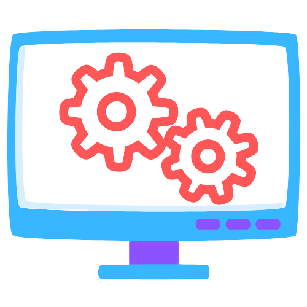

<!-- PROJECT LOGO -->
 

  

  <h3 align="center">TicketViewer</h3>

  

    2022 Internship Zendesk Coding Challenge
     
    <a href="#"><strong>Explore the docs »</strong></a>
     
     
    ·
    <a href="#">View Demo</a>
    ·
  

<!-- TABLE OF CONTENTS -->

  
Table of Contents

  <ol>
    <li>
      <a href="#about-the-project">About The Project</a>
      <ul>
        <li><a href="#built-with">Built With</a></li>
      </ul>
    </li>
    <li>
      <a href="#getting-started">Getting Started</a>
      <ul>
        <li><a href="#prerequisites">Prerequisites</a></li>
        <li><a href="#installation">Installation</a></li>
      </ul>
    </li>
    <li><a href="#usage">Usage</a></li>
    <li><a href="#roadmap">Roadmap</a></li>
    <li><a href="#contributing">Contributing</a></li>
    <li><a href="#license">License</a></li>
    <li><a href="#contact">Contact</a></li>
    <li><a href="#acknowledgments">Acknowledgments</a></li>
  </ol>

<!-- ABOUT THE PROJECT -->
## About The Project

This project is created as a submission for 2022 Internship Zendesk Coding Challenge. The project is a full stack application with React frontend and Express backend. 

THe application is able to perform following tasks:
* It is able to connect to Zendesk API using OAuth Token. (Token just has Read access)
* Fetch all the tickets for a particular account.
* Display the tickets in systematics format with pagination options.
* Display information about a individual ticket by POST request to Zendesk API with ticket id.

Please refer below to view the project structure. 

(<a href="#top">back to top</a>)

### Built With

Major frameworks/libraries used to create the project. 

* [React.js](https://reactjs.org/)
* [Express.js](https://expressjs.com/)
* [Node.js](https://nodejs.org/en/)
* [Axios](https://axios-http.com/docs/intro)
* [React Bootstrap](https://react-bootstrap.github.io/)
* [MUI Datatables](https://github.com/gregnb/mui-datatables)
* [Styled Components](https://styled-components.com/)
* [Zendesk API](https://developer.zendesk.com/api-reference/)

(<a href="#top">back to top</a>)

<!-- GETTING STARTED -->
## Getting Started

Please follow the given instructures to setup the application locally on your system.

### Prerequisites

Please install the given software using the steps given below. 
1. Node
* Dowload the appropriate installation package from the given [link](https://nodejs.org/en/download/)

